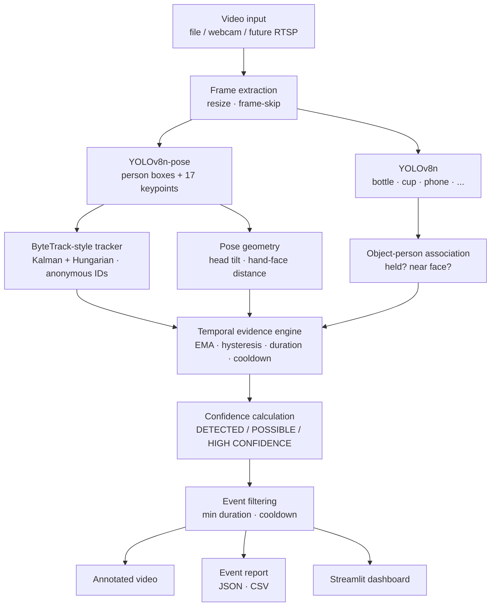
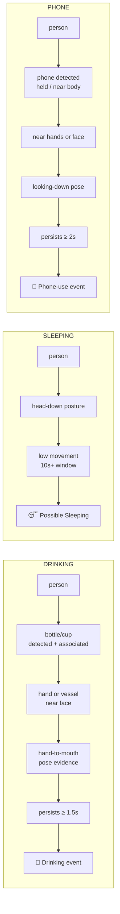

# LibraryGuard

**AI-based prohibited activity detection for CCTV-style video — built on temporal behavior analysis, not single-frame guesses.**

LibraryGuard watches video footage (library, study hall, exam room, office) and flags potentially prohibited behaviors — 🥤 **drinking**, 😴 **sleeping**, 📱 **phone usage** — with anonymous person tracking, confidence labels, annotated output video, and exportable event reports. It runs on a normal laptop CPU and never sends footage anywhere.

<p align="center">
<em>Person #3 &nbsp;·&nbsp; 🥤 DRINKING 91% &nbsp;·&nbsp; t=02:14 &nbsp;·&nbsp; HIGH CONFIDENCE</em>
</p>

---

## Features

- 🎬 **Video-first analysis** — temporal evidence across frames, not image classification
- 🥤😴📱 **Three behaviors** out of the box, each gated by multi-source evidence
- 🧍 **Anonymous multi-person tracking** (ByteTrack-style) — `Person #N` IDs, no facial recognition
- 📊 **Confidence tiers** — `DETECTED` / `POSSIBLE` / `HIGH CONFIDENCE`, with smoothing, hysteresis, cooldowns and minimum durations
- 🎞️ **Annotated output video** — boxes, track IDs, behavior labels, confidence, timestamps
- 📄 **Event reports** — JSON + CSV with timestamps, durations, frame ranges
- 🖥️ **Streamlit dashboard** — upload, tune thresholds, watch results, download reports
- 🧠 **Real ML pipeline** — YOLOv8 detection + pose, Kalman/Hungarian tracking, configurable temporal engine, plus a *trainable* GRU temporal classifier with a full training pipeline
- 🧩 **Extensible** — add a new behavior with one class + one config block
- 🔒 **Privacy-first** — local processing, face blur, data-minimized reports, no telemetry
- ✅ **Tested & CI'd** — 133 unit tests, lint + secret scan in GitHub Actions

## Problem Statement

In spaces like libraries and exam halls, staff need to know when prohibited
activity occurs — but reviewing hours of CCTV by hand doesn't scale. A naive
CV solution ("bottle detected → drinking") produces constant false alarms.
The hard part is not *detecting objects*; it's **recognizing behaviors over
time**, attributing them to the right person, and staying quiet unless the
evidence is actually strong.

## Why Temporal Behavior Detection?

| Single-frame classifier | Temporal behavior analysis (LibraryGuard) |
|---|---|
| Sees a bottle → says "drinking" | Requires vessel + hand-to-face + persistence across seconds |
| Sees a head → guesses "sleeping" | Requires head-down posture **and** stillness **for minutes** |
| Sees a phone on a desk → "phone use" | Phone must be *held by the person* near hands/face, sustained |
| Flickering, spammy alerts | Smoothed evidence, hysteresis, cooldowns, min durations |

Drinking is a *sequence* of events (raise → approach mouth → tilt → lower).
Sleeping is a *posture held over time*. Any credible system must reason over
frames, tracks, and durations — which is exactly what this architecture does.

## System Architecture



Detection evidence per behavior (each behavior = several *joint* conditions):



## Supported Behaviors

| Behavior | Evidence required (all of) | Min duration (default) | Label used |
|---|---|---|---|
| 🥤 Drinking | vessel detected **+** associated with person **+** hand/vessel near face **+** pose consistency | 1.5 s | `drinking` |
| 😴 Sleeping | person tracked **+** head-down posture **+** low motion over time | 10 s | `sleeping` ("Possible Sleeping") |
| 📱 Phone usage | phone detected **+** held/owned by person **+** near hands/face **+** looking-down pose | 2.0 s | `phone_usage` |

All thresholds live in [`configs/config.yaml`](configs/config.yaml) — nothing is hard-coded.

## Machine Learning Approach

**Chosen: Option D — a hybrid** (rationale in [docs/architecture.md](docs/architecture.md)):

1. **Detection** — YOLOv8n / YOLOv8n-pose (Ultralytics), pretrained on COCO:
   person + keypoints, and the object vocabulary (bottle, cup, wine glass,
   bowl, cell phone, book, laptop).
2. **Tracking** — ByteTrack-style tracker (Kalman motion model, Hungarian
   assignment via SciPy, two-stage high/low-score association) giving stable
   anonymous IDs. A BoT-SORT variant with Mahalanobis gating is included.
3. **Temporal behavior engine** — per-person evidence scoring (object-person
   association, hand-to-face distance, head tilt, stillness) aggregated with
   EMA smoothing, consecutive-frame requirements, hysteresis, minimum
   durations, and cooldowns → events with calibrated confidence.
4. **Trainable temporal module** — a bidirectional GRU + attention over the
   same per-person feature sequences (`src/models/temporal.py`), with a real
   training pipeline (`scripts/train.py`) on prepared action datasets.

**What is pretrained vs. trained:** the detectors/pose estimators are
pretrained (COCO, via Ultralytics). The temporal behavior layer is
engineered here and is also *learnable* end-to-end from dataset clips via
`prepare_data → train → evaluate`. **No metrics are ever invented**: if a
training run hasn't happened in your environment, reported metrics are
explicitly "unavailable" (see [Performance](#performance)).

## Dataset Sources

Registry with licenses and preparation steps: **[docs/datasets.md](docs/datasets.md)**.

| Dataset | Used for | License |
|---|---|---|
| COCO | detector/pose pretraining (via Ultralytics weights) | CC BY 4.0 |
| UCF101 (`Drink` etc.) | temporal classifier training | research use (site terms) |
| HMDB51 (`drink`, `sit`, ...) | supplementary temporal training/eval | research use |
| Kinetics-700 (subset) | optional temporal augmentation | CC BY 4.0 labels + source terms |
| Roboflow public projects | optional phone/sleeping fine-tuning | **per-project — inspect each** |
| ActivityNet v1.3 | optional event-level eval | research use + registration |

Datasets are **not redistributed** here; download/prepare scripts and
manifests are provided instead. Test fixtures are synthetic and generated
on the fly.

## Dataset Preparation

```bash
# Validate: missing/corrupt files, label legality, MD5 + perceptual duplicates
python scripts/prepare_data.py validate --manifest data/manifests/ucf101.csv --report data/manifests/validation.json

# Leakage-safe split: frames from one source video never span train/val/test
python scripts/prepare_data.py split --manifest data/manifests/ucf101.csv --out data/manifests/splits

# Extract per-person feature sequences for the temporal model
python scripts/prepare_data.py sequences --manifest data/manifests/splits/train.csv --out data/sequences/train
```

The `group` column (source video ID) enforces the no-leakage rule;
`assert_leakage_free()` fails loudly if it's ever violated.

## Installation

```bash
git clone https://github.com/<you>/libraryguard-ai.git
cd libraryguard-ai
python -m venv .venv && source .venv/bin/activate    # Windows: .venv\Scripts\activate
pip install -r requirements.txt
```

Requirements: Python 3.10–3.13, CPU is fine (GPU optional). YOLOv8 weights
(~13 MB) download automatically on first use.

## Running the Application

### Dashboard

```bash
streamlit run app/streamlit_app.py
```

1. Upload a video (or use the bundled sample)
2. Pick behaviors, confidence threshold, min duration, cooldown, frame skip
3. Run detection — watch progress and live evidence pills
4. Review the annotated video + event table
5. Download the JSON/CSV report

```
┌────────────────────────────────────────────────┐
│ 📡 LIBRARYGUARD  ·  AI BEHAVIOR MONITORING     │
│                                                │
│ Video: library_sample.mp4    1920×1080  25fps  │
│ Detection: ☑ Drinking ☑ Sleeping ☑ Phone Use   │
│ Confidence threshold: 0.55                     │
│ Minimum event duration: 2 s                    │
│                                                │
│ ── EVENTS ──────────────────────────────────── │
│ 🥤 Drinking        Person #3   02:14   91%     │
│ 😴 Possible Sleeping Person #7  03:47   84%    │
│ 📱 Phone Usage      Person #2   05:21   88%    │
│                                                │
│ [Download JSON]  [Download CSV]  [Annotated]   │
└────────────────────────────────────────────────┘
```

### CLI

```bash
python scripts/predict.py --source video.mp4 \
    --output outputs/annotated.mp4 \
    --report outputs/events.json \
    --csv outputs/events.csv

python scripts/predict.py --source webcam --duration 30   # webcam mode
```

### Docker

```bash
docker compose up --build    # dashboard on http://localhost:8501
```

Deployment options (incl. Streamlit Community Cloud): [docs/deployment.md](docs/deployment.md).

## Training

```bash
python scripts/train.py --train-dir data/sequences/train \
    --val-dir data/sequences/val \
    --out models/temporal_classifier.pt --epochs 20 --plot
```

Real training: per-epoch train/val loss & accuracy are logged to
`models/history.json`, early stopping on val loss, best checkpoint saved.
Reproduction steps and dataset acquisition: [docs/datasets.md](docs/datasets.md),
[models/README.md](models/README.md).

## Evaluation

```bash
# Clip-level: precision / recall / F1 / confusion matrix / per-class FPR+FNR
python scripts/evaluate.py --checkpoint models/temporal_classifier.pt \
    --data-dir data/sequences/test --out outputs/evaluation --plots

# Event-level: temporal-IoU matching of predicted vs. ground-truth events
python scripts/evaluate.py --predictions outputs/events.json \
    --ground-truth data/gt/events.json --out outputs/evaluation
```

Unit-level behavior of the engine (thresholding, durations, cooldowns,
tracking, schemas) is covered by the automated test suite:

```bash
pytest tests/ -q
```

## Example Output

Event report (`outputs/events.json`):

```json
{
  "report_version": "1.0",
  "source": "library_sample.mp4",
  "video": { "duration_seconds": 421.7, "fps": 25.0, "frames": 10543 },
  "processing": { "frames_processed": 5271, "processing_fps": 6.2 },
  "event_count": 3,
  "events": [
    {
      "timestamp": "00:02:14.000",
      "event": "drinking",
      "person_id": 3,
      "confidence": 0.91,
      "label": "HIGH CONFIDENCE",
      "duration": 3.2,
      "frame_start": 3350,
      "frame_end": 3430
    }
  ],
  "disclaimer": "Computer-vision predictions are probabilistic and can be wrong."
}
```

Annotated video: bounding boxes, `Person #N` IDs, emoji behavior labels with
confidence %, evidence tier, duration, and a timestamp/frame/FPS banner.

## Performance

Honest status of this environment's runs — **no numbers are fabricated**:

| Item | Status |
|---|---|
| Unit/integration tests (133) | ✅ passing |
| End-to-end pipeline smoke test (CPU, YOLOv8n, synthetic clip) | ✅ ~4–8 FPS processing on CPU vCPU |
| Temporal classifier training metrics | ⏳ **unavailable until you run training** on a prepared dataset (`scripts/train.py`) — results land in `models/history.json` & `outputs/evaluation/` |
| Event-level benchmark vs. public ground truth | ⏳ **unavailable** until you run `scripts/evaluate.py` with ground-truth events |

Benchmark any machine with:

```bash
python -c "from src.evaluation.metrics import fps_benchmark; print(fps_benchmark(lambda x: x, 0))"
```

Speed levers: `frame_skip`, `input_resize`, `yolov8n` vs larger variants,
FP16 on GPU. See [docs/deployment.md](docs/deployment.md#performance-guidance).

## Limitations

Be aware of these — the system is an **AI-assisted review tool, not an authority**:

- **Lighting** — low/backlit scenes degrade detection and pose quality.
- **Camera angle** — overhead/side views change head-tilt geometry; pose cues weaken at extreme angles.
- **Occlusion** — a person behind a shelf/monitor may lose keypoints; tracking IDs can swap in crowds.
- **Crowds** — many overlapping people stress any tracker.
- **Drinking vs. other hand-to-face actions** — eating, yawning, or adjusting glasses can resemble drinking; that's why evidence is tiered (`POSSIBLE` ≠ `HIGH CONFIDENCE`).
- **Sleeping is genuinely hard from CCTV** — "head down + still" also describes reading, writing, or phone use at a desk; labels say *Possible* Sleeping for a reason. Eye-state is not analyzed.
- **Partially hidden phones** — a phone in a lap or behind a book may not be detected.
- **Confidence ≠ certainty** — all outputs are probabilistic; false positives and false negatives are expected.
- **Viewpoint/domain shift** — models trained on COCO may behave differently on grayscale IR CCTV.
- **Not a person-identification system** — events reference anonymous track IDs that reset per video.

## Privacy & Responsible Use

Full policy: **[docs/privacy.md](docs/privacy.md)**. In short:

- ✅ Local processing only; no footage leaves the machine
- ✅ Anonymous temporary track IDs; **no facial recognition, no identity data**
- ✅ Optional face blurring in outputs (on by default)
- ✅ Reports contain behavior + timing only (asserted by tests)
- ✅ Raw video not stored by the pipeline
- ⚠️ Have a lawful basis + transparency (signage/policy) before deploying
- ⚠️ Always keep a human in the loop; never act on output alone

## Future Improvements

- RTSP/IP-camera streaming source (interface is ready — see `WebcamPipeline`)
- Appearance features in tracking (true BoT-SORT) for crowded scenes
- Zone configuration (restricted areas, workstation occupancy)
- Distillation of the GRU temporal module into the live pipeline once trained
- More behaviors: eating, smoking, running, crowding ([guide](docs/adding_behaviors.md))
- ONNX/TensorRT export for edge devices
- Semi-automatic ground-truth tooling for event annotation

## Project Structure

```
libraryguard-ai/
├── app/streamlit_app.py        # dashboard UI
├── src/
│   ├── detection/              # YOLOv8 person/object/pose detection
│   ├── tracking/               # ByteTrack-style tracker (Kalman + Hungarian)
│   ├── behavior/               # behavior detectors + temporal event engine
│   ├── preprocessing/          # video I/O, dataset validation & splitting
│   ├── models/                 # trainable GRU temporal classifier
│   ├── evaluation/             # metrics + plots
│   ├── reporting/              # event log, CSV/JSON export, annotation
│   ├── utils/                  # config, constants, geometry
│   └── pipeline.py             # end-to-end orchestration (source-agnostic)
├── scripts/                    # prepare_data.py · train.py · evaluate.py · predict.py
├── configs/config.yaml         # every tunable threshold
├── tests/                      # 133 pytest unit/integration tests
├── docs/                       # architecture · datasets · privacy · deployment · extending
├── data/                       # (git-ignored data; README + sample clip only)
├── models/                     # (git-ignored weights; README explains how to obtain)
├── notebooks/                  # walkthrough notebook
├── .github/workflows/ci.yml    # lint + tests + import + secret scan
├── Dockerfile · docker-compose.yml · .streamlit/
├── requirements.txt · pyproject.toml
└── LICENSE (MIT)
```

## Contributing

Issues and PRs welcome. For new behaviors, follow
[docs/adding_behaviors.md](docs/adding_behaviors.md). Please:

1. Add/extend tests for any behavior change (`pytest tests/ -q`).
2. Never commit datasets, weights, footage, or secrets.
3. Keep thresholds in `configs/config.yaml`, not in code.
4. Be precise in docs about what is measured vs. estimated.

## License

[MIT](LICENSE). Note that third-party **datasets** have their own licenses
([docs/datasets.md](docs/datasets.md)), and Ultralytics YOLOv8 weights are
subject to the AGPL-3.0 / Ultralytics enterprise license terms — review them
for commercial deployment.

---

<p align="center">
<sub>Behavioral detection, not identity surveillance. Predictions are probabilistic — always keep a human in the loop.</sub>
</p>
